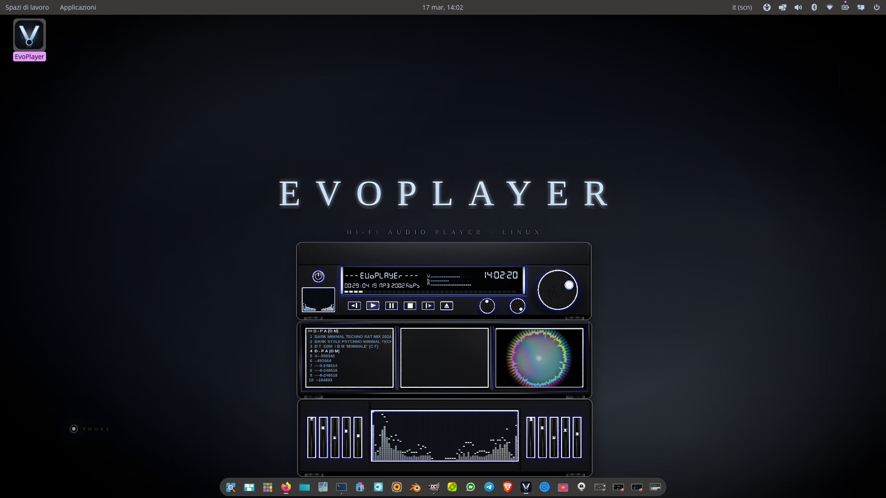
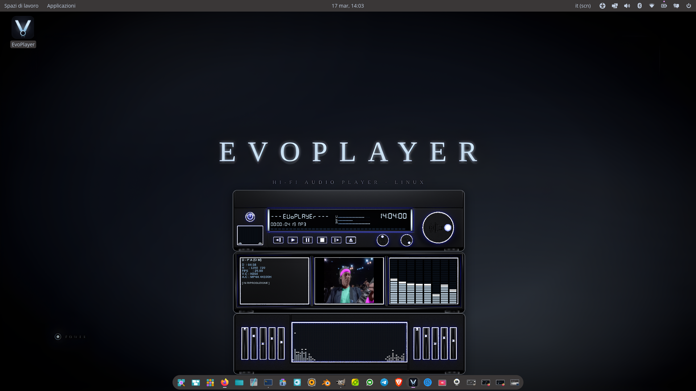

# 🎛️ EvoPlayer

**A modular hi-fi audio player for Linux, inspired by Kenwood stereos of the 90s.**

> *"You don't just install it. You assemble your own hi-fi system."*

---

## ✨ What is EvoPlayer?

EvoPlayer is not just an audio player. It is a **physical hi-fi experience on your desktop**.

Three independent modules — Player, Equalizer, Library — float freely on your screen, snap together magnetically, and look like a real 90s hi-fi rack. Built from scratch with OpenGL, Qt5, and Blender-rendered panels.

---

## 🖥️ Features

- 🎚️ **Modular design** — 3 independent windows, freely movable and magnetically snapping
- 🎨 **Photorealistic panels** — rendered in Blender 5, Kenwood-inspired aesthetic
- 🌊 **Dynamic parallax** — mouse movement rotates the panel ±2.5°
- 📊 **Real-time FFT VU meter** — ice blue #D6EEFF LED style
- 🎛️ **10-band equalizer** with physical sliders
- 📚 **Music library** with file browser
- 🎬 **Video playback** in the mini display
- 🔘 **Physical knobs** — Bass, Mid, Volume with rotation
- 🎨 **Skin system** — fully customizable panels
- 🔌 **Plugin architecture** — dynamic .so loading

---

## 📸 Screenshots





---

## 🚀 Installation

### Dependencies
```bash
# Ubuntu / Pop!_OS / Debian
sudo apt install qt5-default libqt5opengl5-dev libglew-dev libfreetype-dev libqmmp-dev

# Arch Linux
sudo pacman -S qt5-base glew freetype2 qmmp
```

### Build from source
```bash
git clone https://github.com/evoplayer-official/EvoPlayer.git
cd EvoPlayer
qmake EvoPlayer.pro
make -j4
./build/EvoPlayer
```

---

## 🎨 Skin System

EvoPlayer supports custom skins. Each skin is a folder inside `skins/` containing:
- `player_panel.png` — main panel (2048×1600px, transparent background)
- `buttons/` — all button states
- `knobs/` — knob images
- `skin.ini` — configuration

See `assets/guida_skin.md` for full documentation.

---

## 📬 Community

- 💬 Reddit launch post: **r/LinuxPorn** — *most upvoted post ever on day one*
- 🌍 13,000+ Linux users across 10 countries on launch day

---

## 👤 Author

**Marco** — vision, aesthetics, direction  
Built with passion, from zero, without any programming knowledge.  
*"Tu l'anima, io le mani."*

---

## 📄 License

GNU General Public License v3.0 — see [LICENSE](LICENSE) for details.

---

*From zero to 13,000 people in one day. The journey continues.*
